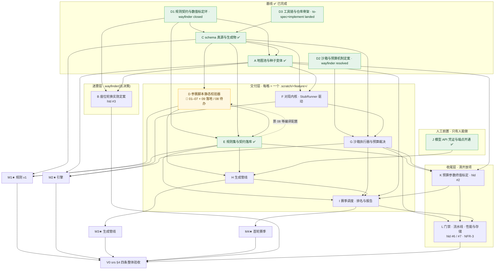

# v0 里程碑目标节点与依赖 DAG

| 项 | 值 |
|---|---|
| 作用 | 把 `fsr.md` §4.2 的四个里程碑(M1–M4)展开成中间目标节点,标出依赖边、关键路径与各节点该走哪条 skill 流程 |
| 本文件拥有 | 从当前基线到 v0 验收的节点划分与依赖拓扑 |
| 本文件不写 | 规则机制与取值(→ gdd / `rulesets/v1.json`)、工程方案(→ hld)、需求定义(→ srs)、里程碑估算(→ fsr) |

## 1. 粒度约定

一个节点 = ask-matt 流程里的**一个工作单元**,不是代码里的一个模块:

- **wayfinder 节点** = 一个 `.scratch/<feature>/map.md` + `issues/`,出**决策**,不出交付物;收口后 `handoff` 交出去,不自己动手实现。
- **交付节点** = 一个 `.scratch/<feature>/` 工作目录,内含 `spec.md` + `issues/`,走主流水线 `grill-with-docs` → `to-spec` → `to-tickets` → `implement`。`implement` 每票内部驱动 `tdd`,收尾跑 `code-review`;**票之间要 `clear`**。
- 人工前置 = `wizard`,只做 agent 做不了的事。

因此**「grill-with-docs」不是独立节点**,它是每个交付节点的入口阶段;把它单列成节点会把粒度切碎。

`/to-tickets` 产出的票已经是 agent-ready,**不要走 `triage`**(ask-matt 明确:triage 只服务外部来的票)。

**归层看的是「这个工作单元出决策还是出交付物」,不看它当前走到哪一步**。一个交付节点在实施中仍然是交付节点,不会因为「决策还没裁完」被挪回迷雾层——挪层等于把它换成一个 wayfinder map,那是换一件工作,不是换一种进度记法。节点 A 由迷雾层改判为交付层(它最终交出 `maps/` 与 `map-lint`,不交决策)时依据的就是这一条;状态列另记进度,两件事分开。

**图例**:✅ 已完成 · 🔶 实施中 · ○ 未开。

## 2. 基线(✅ 已完成,不计入关键路径)

| ID | 状态 | 工作单元 | 流程 | 落到磁盘上的东西 |
|---|---|---|---|---|
| D1 | ✅ | 规则契约与数值标定环 | `wayfinder`,**closed**(14 票) | 决策在 gdd v2.2;**取值与契约定稿已各自落库**(`rulesets/v1.json` / `docs/rules-v1/`),当年那份一次性 `handoff.md` **已作废**(留作历史证据);4 份盲写脚本在 `blind/cell-{a,b,c,d}/`(草案契约下,与终稿不可互比) |
| D2 | ✅ | 沙箱与预算机制定案 | `wayfinder`,**resolved**(6 票) | 决策在 hld §5;实测原始输出在 `.scratch/sandbox-budget/spike/` |
| D3 | ✅ | 工具链与仓库骨架 | `grill-with-docs`→`to-spec`→`to-tickets`→`implement`,已落地 | `apps/cli` + 7 个包 + 三道机器门禁 + `CONTEXT.md` |
| C | ✅ | schema 真源与生成物 | 同上,6 票全部落地 | `packages/schema` 类型 / `JsonValue` / 21 键清单 / JSON Schema + ajv 读入端校验 + 生成器与漂移检查 |
| A | ✅ | 地图池与种子变体 | 同上,7 票 **resolved** | `maps/` 三张四重对称真图 + `modelwar map-lint` 两层判据 + `variantSlots` 定稿 + gdd #2/#6 收口 |

**基线的性质**:两张 wayfinder map 都只出决策与 throwaway 证据,没有一份出落库;三个交付节点(C、D、A)中 C 与 A 已落库。磁盘现状——

```
maps/        corridor-split.json · fortress-core.json · open-clash.json
rulesets/    v1.json（21 键）
docs/rules-v1/  rules.md · api.md
benchmarks/  cell-a-melee-pressure/ · cell-b-expansion-economy/ · cell-c-claim-no-harvest/
prompts/     仍是 .gitkeep
```

——**当前位置:五格基线已落,M1 交付物已交齐**(`rulesets/`、`docs/rules-v1/`、`benchmarks/` 三件归 E),`prompts/` 仍归 H。

## 3. 主图



## 4. 节点表

**状态列的取值**:✅ `已完成`(工作单元已收口,决策或交付物在磁盘上)/ 🔶 `实施中`(spec 与票已就绪,主干已落地,仍有未收口的票)/ `ready-for-agent`(票已就绪,可直接开 `/implement`)/ ○ `未开`(尚未开工)/ ○ `未开(人工)`(未开工且只有人能做)。

这一列**不是** issue 的 triage 标签那一套(`docs/agents/triage-labels.md` 管的是票),但 `ready-for-agent` 一词与票文件里的 `Status:` 取值同源——同一状态不两种叫法。

### 迷雾层(`wayfinder`)

| 节点 | 状态 | 目的地 | 硬依赖 | 站位提示 |
|---|---|---|---|---|
| **B 座位轮换实效定案** | ○ 未开 | 量化 `(tick+playerIndex) mod 4` 的头对头偏置,验证赛季尺度被摊平 | D1、**A**(地图决定偏置)、I(首轮赛季是数据来源) | 交接单 §2.3 已给验收命题(那份交接单**已作废**,这里引的是它的历史陈述:「桩在 1168 场上显示座位不等价,量级尚无独立测量」)——**这正是 wayfinder 的形状:需要新证据,证据方法本身待定**。A 已落地这条依赖已解除,但 I 仍是硬前置,所以它是全图最后开的一张图。**要不要用桩提前测一轮**是个决策:测了会拿到一个关于已丢弃实现的结论,我倾向不测,直接排到 I 之后 |

### 交付层(每格走 `grill-with-docs` → `to-spec` → `to-tickets` → `implement`)

| 节点 | 状态 | 交付物 | 硬依赖 | 里程碑 | 该走的额外 skill |
|---|---|---|---|---|---|
| **C schema 真源与生成物** | ✅ 已完成([spec](../../.scratch/schema-source/spec.md) · 6 票全部落地) | `packages/schema` 的类型 / `JsonValue` / 常量表 / 参数 key 清单(21 键 = 13 定稿 + 8 预算)/ JSON Schema + apps/cli 的 ajv 读入端校验;ruleset 与 map 两类数据的形状;生成器 + 生成物注册表 + 漂移检查 + 声明即依赖门禁 | D1、D3 | — | 已收口。三处当时未决的裁法,落点见 `docs/adr/0003`:①`tools` 走**混合传输**——生成器 import 真源包(低频入口可 afford 构建),规则层读**生成物**(保住快门禁零构建);②`tools` 的依赖门禁缺口**已在本节点补掉**(`check:declared-deps`,不走 depcruise,理由见其规则头注);③键数是 **21 不是 22**——内存软阈是推导展示项,按 spec 自己的规则不入键清单,见 hld §7.1 |
| **A 地图池与种子变体** | ✅ 已完成([spec](../../.scratch/map-pool/spec.md) · 7 票 **resolved**) | `maps/` 三张四重对称真图(点位布局三图共用,风格 100% 由墙承载)+ `modelwar map-lint` 的两层判据(阈值归校验器常量)+ `variantSlots` 定稿为静态候选轨道清单 + gdd #2/#6 的文档收口 | C(已解除)、D1 | **M2★**(与 F 合) | 已收口。两条等效命题在带墙真图上的复验结论(② 过、① 无法判定待重推)与种子数 K=4 的推导链都归 gdd,本表只带指针。**留在图外的两笔交办账见 §7**,不随节点收口一起销账 |
| **D 参赛脚本静态校验器** | 🔶 实施中([spec](../../.scratch/script-validator/spec.md) · 01–07 与 **09 已落地**,**只剩 08**) | 已交:`tools` 校验器入口、禁列全局名、模块系统、宿主桥前缀、脚本体积上限、内置全局白名单判据、四份盲写脚本的不误伤验收 | C(已解除) | — | 只剩一票:**[08](../../.scratch/script-validator/issues/08-parser-source-form-too-wide.md)**(解析层源形态比入口契约宽)——它原先硬依赖 E 的参赛脚本编译配置,**那道阻塞已解除**(配置落在根层 `tsconfig.scripts.json`,由 E 定、H 实现),所以它现在是一条无阻塞票,可以单独接。已裁的三笔:①全局白名单反转**由编译器名字解析承担**(实测推翻 hld §2.2.3/§6.2 的「tools 自建分析器」承载条款,理由:自建分析器的失败模式是误伤合规脚本);②脚本 API 的 `.d.ts` 家定在 `schema`、内容由 F/G 回填;③参赛脚本写 `Math.sqrt` 无人拦 → gdd §8 #11 |
| **E 规则集与契约落库** | ✅ 已完成([spec](../../.scratch/rules-landing/spec.md) · 15 票 **全部 resolved**) | `rulesets/v1.json` 21 键(13 定稿 + 8 预算未定值占位)+ `docs/rules-v1/{rules.md,api.md}`(散文分批落地,数值表/API 表由真源包生成)+ 参赛脚本编译配置(家定在 E,实现归 H)+ 用**终稿**契约重跑盲写三舱 + `benchmarks/` 落库 + 契约自证与 ② 的复验 | C ✅、D 🔶、D1 ✅ | **M1★** | 入口那一轮 grilling **只钉了一条**:终稿 API 面与 D 的实现形状同源——裁法是符号表的回填时点从 G 提前到 E(否则「同源」只剩一句人话),并给生成器加一种**区块形态**让混合的散文文档也能挂生成表格;取舍见 `docs/adr/0004`。其余 21 条裁决未重开。**A 与 D1 交办的两笔账在这里销掉**:gdd §8 #8/#13 的等效命题在终稿契约下复验一次,**② 已过**(证据 `.scratch/rules-landing/selfproof/report.md`,门禁 `check:selfproof`)、**① 仍未排期**(窗口重推是规则侧后续工作,归独立小图,指针留在 gdd §8 记录 #13)。**收尾对账带出的一件**:契约面 `docs/rules-v1/rules.md` 的 §1 / §2 / §5 / §9 四节仍是占位,其中 §5 占领是本轮唯一的真卡点(该节正文**已指派归 gdd《占领机制》**,缺的是面向模型那一节的散文,归下一轮),不在本节点 |
| **F 对局内核** | ○ 未开 | `world` + `driver`(状态模型、id 升序不变量、整数 LCG + `IdGen`、`apply()` 唯一写入口)、`processor` 七步结算管线 + `intents/*.ts` 的 `check()`/`run()`、`snapshot`(深拷贝 + 只读封存)、`Runner` 缝 + `StubRunner`、`replay` 包全行格式与解析、`replay-writer`;`modelwar replay` 的 ASCII 查看器 | C ✅、E、A ✅ | **M2★**(与 G 合) | `codebase-design` 定 `processor` 与 `intents` 的缝、host 侧 `check()` 与 VM 内 dual validation 的共享方式。**A 的地图已落库,这条边已解除**。**用 StubRunner 先打通,让「跑一个完整对局」的闸门提前开**;G 落地后换 QuickJsRunner,结算管线一行不改。**接住 A 交办的首触实测复核**(见 §7) |
| **G 沙箱执行器与预算裁决** | ○ 未开 | `QuickJsRunner` + `engine/sandbox-runtime`(TS→IIFE bundle)+ WASI 三件套常量 + 桥函数删除 + 四类异常轨 + 双计数 + 内存三层 + `exceptionTicks` 续算;`modelwar match` / `verify` 子进程 | D2 ✅、C ✅、F | **M2★** | **本节点第一条验收就是 hld #5 五条复验写回文档并关掉 hld #8**(升级条款在 G 落地前是空头承诺)。`prototype` 只用在一处:hld §2.2.2 把 runtime bundle 的**打包方式**留给实现期,选之前先跑一下 |
| **H 生成管线** | ○ 未开 | `prompts/` 模板数据文件、模型 API 客户端 + 厂商适配 + 退避限流、`models.yaml`、≤5 轮只回喂校验错误、tsc 预编译为 script-mode JS、`archive/<model>/<runId>/` 三件套、meta 完整性校验与缺档拒跑 | E、D 🔶、**J(凭证)** | **M3★** | **与 F/G 零依赖边,可完全并行**。凭证由 `wizard` 提前办 |
| **I 赛季调度、排名与报告** | ○ 未开 | 组合×地图×种子枚举 + `(mapIndex+seedIndex) mod 4` 座位轮换 + `M×K ≡ 0 (mod 4)` 均摊断言、对局子进程池 + `engine-crash`/`nondeterministic-timeout` 重跑与剔除、`input.json` 输入物化、`ranker` 名次积分纯函数、`report.md`/`report.json`/叙事战报 + 校验失败名单 + 规则版本隔离、六个子命令接线 | E、G、H、A ✅、K | **M4★** | `research` 用来选 ≥4 个真实模型(可用性 / 端点 / 定价 / 上下文长度是否够读两份契约)——这是 M4 唯一需要外部一手资料的地方。`ranker` 是纯函数无依赖,可以在 H 还在跑的时候顺手做掉。枚举规模已由 A 的 K=4 定死 |

### 人工前置

| 节点 | 状态 | 内容 | 阻塞 | skill |
|---|---|---|---|---|
| **J 模型 API 凭证与端点开通** | ✅ 已完成(人工,2026-10-04) | 各厂商 API key 走环境变量、端点与账号开通、模型标识 | 无(H 的硬依赖已解除) | **已办**。只接一家聚合商 Command Code(`https://api.commandcode.ai/provider/v1`,GOAT 档):key 落 `.env` 的 `COMMAND_CODE_API_KEY`(gitignore,60,不入 GitHub secrets —— hld §CI 规定 CI 无凭证),已发真实请求验过 HTTP 200。catalog 85 个模型全过上下文尺(契约草案 9K tokens × 10 余量 = 90K,最小的 200K 也够);**端点归属逐模型不同**(Claude 系只走 `/messages`,其余走 `/chat/completions`),H 的适配层须照 `supported_endpoints` 分家。非密钥事实(端点/模型标识/上下文)在 gitignore 的 `.modelwar-providers.md`,填完 `models.yaml` 即弃;变量名契约在 `.env.example`,操作脚本 `scripts/setup-model-credentials.sh` |

### 收尾层

| 节点 | 状态 | 交付物 | 硬依赖 | 归属 |
|---|---|---|---|---|
| **K 预算参数终值标定** | ○ 未开 | 8 个预算键的终值:事件计数上限、API 调用上限、内存分配上限、`memoryTickCeiling`、墙钟软限、墙钟硬超时、`exceptionTickLimit`、脚本体积上限(**内存软阈不在其中**——它是 `0.8 × memoryTickCeiling` 的推导项,按 spec 不入键清单) | E(基准脚本实测峰值)、A ✅(点位数量——全图储量 = 点位里的资源点数 × 单矿储量,预算键的口径靠它)、G(真沙箱实测) | hld #2。验收命题曾在交接单 §2.1(那份单子**已作废**,引的是它的历史陈述;命题本身仍有效,判据的家在 hld §5.3 与本行),**不是迷雾,不需要 wayfinder**。但要**先造两个仓库里不存在的对抗探针**(纯计算死循环 / API 轰炸),否则命题②无从验;命题①明写 1168 场实测异常 0 次、零证据。**必须在 I 之前**——赛季要用定值 |
| **L 门禁、流水线与性能与存储** | ○ 未开 | 集成门禁(端到端 + `verify` + 重跑 10 次 hash)、基准门禁(双脚本对打)、生成物漂移检查接入主流水线、Stryker 变异测试配置、快照拷贝粒度(hld #6)、回放体量与夜间扫描的存储/IO(hld #7)、NFR-3 单场墙钟 X、主/夜间流水线建成 | G、K、I | 入口 `grill-with-docs` 要裁「hld #6 / #7 测什么、优化到什么程度算完」——这两条现在是「先测后优化」,没有停止条件 |

## 5. 关键路径与并行度

**关键路径(7 跳)**:

```
C ✅ → D 🔶 → E 规则落库 ✅(M1★) → F 对局内核 → G 沙箱(M2★) → K 预算终值 → I 赛季(M4★)
```

四条结论:

1. **根节点已出**。C 在关键路径上,同时又是 H 的间接前置——它已落地,四条链的起跑条件全部解除。
2. **H 与 F/G 零依赖边**。H 只需 E、D、J。FSR 把「引擎 1~2 周 + 管线 1 周」串行估,实际可以并行跑完。
3. **A 已收口**,不再阻塞 F 的端到端验收与 I 的枚举规模(种子数 K=4 已定,推导链归 gdd《开放项》#6 的记录 #12,本节只带指针)。别把它与图上的**节点 K**(预算参数终值标定)混成一件:那条边要的输入是**点位数量**,与种子数无关。
4. **K 卡在 G 与 I 之间**,是唯一被硬阻塞的收尾项。G 排得越晚,赛季越晚。

**当前 frontier**:

| 可开的东西 | 类型 | 前置 |
|---|---|---|
| **F 对局内核** | 交付节点,进 `grill-with-docs` | **前置全在图上且已解除**:C ✅、A ✅、E ✅(E 的 15 票全部落地,M1 交付物已交齐);D-08 与 F 零依赖,可并行 |
| **D-08 解析层源形态** | D 节点最后一张票 | 原先等 E 的编译配置,现已落库 → **无阻塞**,可单独接 |

**E 的遗留**:D-08 原先硬依赖参赛脚本的编译配置,那道阻塞随 **E 的 06 号票**解除——现在它是一条无阻塞票。

**可并行批次**:

| 波 | 节点 | 说明 |
|---|---|---|
| 0 | D1 D2 D3 | ✅ 已完成 |
| 1 | **C** | ✅ 已完成(6 票全落地)。唯一的根,无前置 |
| 2 | **A** D J | ✅ A 已收口(三张真图 + map-lint 两层断言 + variantSlots 定稿);D 01–07 与 09 已落地,余 D-08 一票;J 已于 2026-10-04 办结(凭证 + 端点 + 85 个模型目录,已发真实请求验证) |
| 3 | **E** → M1★ | ✅ 已收口(15 票全部落地):取值落库、两份契约文档、编译配置、三舱盲写重跑、基准脚本、契约自证。E 完成后 M1★ 即可关;D-08 的编译配置依赖已解除 |
| 4 | **F** | 依赖已全部解除,可整格开;StubRunner 打通端到端闸门 |
| 5 | **G** → M2★ | |
| 6 | **H** ∥ **K** | H 只等 E 与 J,与 F/G 零边;K 等 E、G |
| 7 | **I** → M4★ | |
| 8 | **B** **L** | 两者都要首轮赛季的数据 |

## 6. 从里程碑视角看到的三个真实缺口

FSR §4.2 的 M1 写的是「最小规则集 + 脚本 API 定稿,模型生成 ≥2 个基准脚本验证规则闭环与区分度」。按此口径(E 已收口,前两条已销):

| 缺口 | 事实 | 落在哪个节点 |
|---|---|---|
| ~~**M1 的验收是用草案做的**~~ **已销** | 4 舱盲写跑在 `draft/` 契约上;终稿按 handoff §4(那份交接单**已作废**)的 21 条裁决改写,其中 6 条是 P0(`getMyIndex()` 单入口、`isError`/`errCode`、快照字段补 API 面、TS/JS 记法自洽) | **E** ✅。终稿重跑已做(三舱零违规),终稿 API 面与 D 的白名单读同一份符号表(票 02 回填);**留下一处**:契约面 `rules.md` 的 §1/§2/§5/§9 四节仍是占位,§5 占领是唯一真卡点 → 下一轮补那节散文,归属已指派到 gdd《占领机制》(正文已在那儿),缺口读数见 gdd §8 记录 #14 |
| **预算参数零证据** | 交接单 §2.1(已作废)验收命题①:1168 场桩实测异常 **0 次**,`exceptionTickLimit` 下限不能凭直觉取值;命题②要的两个对抗探针(纯计算死循环 / API 轰炸)**仓库里不存在** | **K**。不能只做取值,必须先造探针 |
| **M1 交付物只差一件** | E 已交出 `rulesets/`、`docs/rules-v1/`、`benchmarks/`(A 早先交出 `maps/`);`prompts/` 仍全是 `.gitkeep` | **H** 交 `prompts/` |

**估算口径**:fsr §4.2 声明「hld 已定稿的工程面(沙箱集成实测、schema 真源与生成物 CI、工具链选型)不计入该估算,可能推翻合计值」。这三项中工具链与 schema 真源已落地,只剩沙箱集成实测(G)还在图上;**剩余 3~6 周是在推翻后的口径上重新计的**。本文件不给估算,那是 fsr 的家。

## 7. 一处不该被 DAG 掩盖的事

D1 的桩模拟器跑过 1336 场,给出 gdd §8 全部四条记录(#7 枯竭定位、#9 终局形态边界、#10 骑兵闲置)。但**桩不是引擎**——真正接住那些结论的是 **F 的结算管线**:每条记录都要在真引擎上以属性测试或基准门禁的形式复验一次,否则它们只是关于一个已丢弃实现的观察。图上这条边是 `F ⇢ L`,不在里程碑的显式依赖里,但它决定 M2 收尾要补多少测试。

同理,A 的两条等效命题验完之后还要在 I 的首轮赛季上复验一次。**A 已收口,但它交办出去的账不随收口销账**,各有一个明确的落点:

| 交办项 | 落在哪 | 不做会怎样 |
|---|---|---|
| 终稿契约下复验 gdd §8 #8/#13 的两条等效命题 | **已销账(E 的 14 号票)**:命题 **② 已过**(证据 `.scratch/rules-landing/selfproof/report.md`,门禁 `check:selfproof`,记录写在 gdd §8 记录 #13)。**① 仍未排期**——窗口重推是规则侧后续工作,已裁成独立小图/小票,**指针保留在 gdd §8 记录 #13,状态不改** | 那两条结论只对标定环的草案脚本成立,与 v0 实际用的脚本不是同一批;① 在窗口定案前**根本无从复验**——销账只销 ②,读到「已销账」三个字的人若以为两条都过了,就会拿一个没人验过的窗口去当基线 |
| 三张图进**真引擎**后的首触实测复核 | **F**(原型只做到估算口径,真引擎的值未知) | **复核必须带上 gdd §4 记的那条基线偏差**——偏差的量值与出处只在那里,本表不复制;要跟着复核一起带的是**理由**:它与墙无关,不把它算进去,真引擎跑出来的首触值就会被误读成「墙把首触推了」 |

**这是 throwaway 证据的通用账,一次地图池、一次内核、一次赛季,各结一次。**