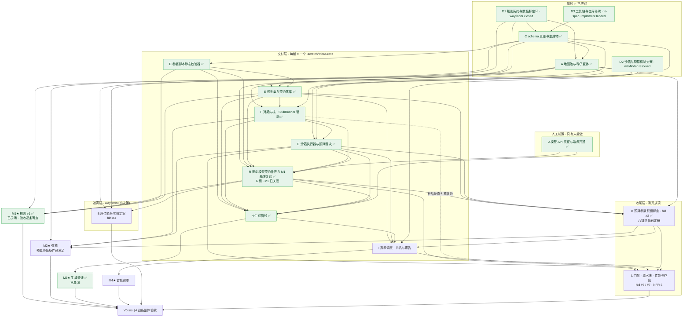

# v0 里程碑目标节点与依赖 DAG

| 项 | 值 |
|---|---|
| 作用 | 把 `fsr.md` §4.2 的四个里程碑(M1–M4)展开成中间目标节点,标出依赖边、当前依赖主干与各节点该走哪条 skill 流程 |
| 本文件拥有 | 从当前基线到 v0 验收的节点划分与依赖拓扑 |
| 本文件不写 | 规则机制与取值(→ gdd / `rulesets/v1.json`)、工程方案(→ hld)、需求定义(→ srs)、里程碑估算(→ fsr) |

## 1. 粒度约定

一个节点 = ask-matt 流程里的**一个工作单元**,不是代码里的一个模块:

- **wayfinder 节点** = 一个 `.scratch/<feature>/map.md` + `issues/`,出**决策**,不出交付物;收口后 `handoff` 交出去,不自己动手实现。
- **交付节点** = 一个 `.scratch/<feature>/` 工作目录,内含 `spec.md` + `issues/`,走主流水线 `grill-with-docs` → `to-spec` → `to-tickets` → `implement`。`implement` 每票内部驱动 `tdd`,收尾跑 `code-review`;**票之间要 `clear`**。
- 人工前置 = `wizard`,只做 agent 做不了的事。

因此**「grill-with-docs」不是独立节点**,它是每个交付节点的入口阶段;把它单列成节点会把粒度切碎。

`/to-tickets` 产出的票已经是 agent-ready,**不要走 `triage`**(ask-matt 明确:triage 只服务外部来的票)。

**归层看的是「这个工作单元出决策还是出交付物」,不看它当前走到哪一步**。一个交付节点在实施中仍然是交付节点,不会因为「决策还没裁完」被挪回迷雾层——挪层等于把它换成一个 wayfinder map,那是换一件工作,不是换一种进度记法。节点 A 由迷雾层改判为交付层(它最终交出 `maps/` 与 `map-lint`,不交决策)时依据的就是这一条;状态列另记进度,两件事分开。

**图例**:✅ 已完成 · 🔶 实施中 · ○ 未开。主图实线为硬依赖;虚线为不阻塞节点收口的证据复验义务。

## 2. 基线(✅ 已完成,不计入后续待办)

| ID | 状态 | 工作单元 | 流程 | 落到磁盘上的东西 |
|---|---|---|---|---|
| D1 | ✅ | 规则契约与数值标定环 | `wayfinder`,**closed**(14 票) | 决策在 gdd v2.2;取值真源与契约文档已落库(`rulesets/v1.json` / `docs/rules-v1/`),面向模型的契约正文的 §5/§9 已由 R 落库、§1/§2 仍是明文 out-of-scope 的占位(见 §6);当年那份一次性 `handoff.md` **已作废**(留作历史证据);4 份盲写脚本在 `blind/cell-{a,b,c,d}/`(草案契约下,与终稿不可互比) |
| D2 | ✅ | 沙箱与预算机制定案 | `wayfinder`,**resolved**(6 票) | 决策在 hld §5;实测原始输出在 `.scratch/sandbox-budget/spike/` |
| D3 | ✅ | 工具链与仓库骨架 | `grill-with-docs`→`to-spec`→`to-tickets`→`implement`,已落地 | `apps/cli` + 7 个包 + 三道机器门禁 + `CONTEXT.md` |
| C | ✅ | schema 真源与生成物 | 同上,6 票全部落地 | `packages/schema` 类型 / `JsonValue` / 21 键清单 / JSON Schema + ajv 读入端校验 + 生成器与漂移检查 |
| A | ✅ | 地图池与种子变体 | 同上,7 票 **resolved** | `maps/` 三张四重对称真图 + `modelwar map-lint` 两层判据 + `variantSlots` 定稿 + gdd #2/#6 收口 |

**基线的性质**:两张 wayfinder map 都只出决策与 throwaway 证据,没有一份出落库;交付层的七格 **C、D、E、A、F、G、R 工作单元均已收口**。E 的文档与基准脚本已落库;M1 已由 R 关闭。磁盘现状——

```
maps/        corridor-split.json · fortress-core.json · open-clash.json
rulesets/    v1.json（21 键）
docs/rules-v1/  rules.md · api.md
benchmarks/  cell-a-melee-pressure/ · cell-b-expansion-economy/ · cell-c-claim-no-harvest/
packages/engine/sandbox-runtime/  runtime.iife.js 入库产物 + 漂移门禁(adr/0007)
prompts/     base.md(薄壳 + 指针清单;`{{strategy}}` 可选)
archive/     deepseek-v4-flash/2026-10-08T05-12-42-057Z/(首份真实冻结存档三件套)
```

——**当前位置:基线五格(D1 D2 D3 C A)与交付层的 D、E 已落库**;**F 对局内核已收口**(12 票全部 resolved,`runMatch` 唯一外部缝已打通);**G 沙箱执行器与预算裁决已收口**(11 票全部 resolved,真沙箱 `match → verify` 端到端打通,hld §12 #8 随五条探针关闭);**R 面向模型契约补齐与 M1 基准复验已收口**(6 票全部落地,spec 在 `.scratch/contract-closure/spec.md`):§5 占领与 §9 确定性约束已落库,三舱盲写 0 轮契约静态校验通过 3/3、真引擎 10 局复验 10/10 全过,**M1 关闭**。**K 预算参数终值标定已收口**(8 票全部 resolved,八个预算键落终值、`check:budget` 门禁与三轨异常探针落地);K 收口后 **B / H 收口 / L** 的前置依次解锁;**H 生成管线已收口**(9 票全部落地,PR #10):`prompts/base.md` 薄壳 + `models.yaml` + HTTP 三端点族 + ≤N 轮只回喂静态校验错误 + tsc 编译 + 原子冻结,首份真实冻结存档落在 `archive/deepseek-v4-flash/2026-10-08T05-12-42-057Z/`(真模型 3 轮、2 次回喂),`modelwar match` 装载通过,**M3 关闭**;`prompts/` 不再是缺项。

## 3. 主图



## 4. 节点表

**状态列的取值**:✅ `已完成`(工作单元已收口,决策或交付物在磁盘上)/ 🔶 `实施中`(spec 与票已就绪,主干已落地,仍有未收口的票)/ `ready-for-agent`(票已就绪,可直接开 `/implement`)/ ○ `未开`(尚未开工)/ ○ `未开(人工)`(未开工且只有人能做)。

这一列**不是** issue 的 triage 标签那一套(`docs/agents/triage-labels.md` 管的是票),但 `ready-for-agent` 一词与票文件里的 `Status:` 取值同源——同一状态不两种叫法。

### 迷雾层(`wayfinder`)

| 节点 | 状态 | 目的地 | 硬依赖 | 站位提示 |
|---|---|---|---|---|
| **B 座位轮换实效定案** | ○ 未开 | 量化 `(tick+playerIndex) mod 4` 的头对头偏置,验证轮换能否在赛季尺度摊平偏置 | D1、**A**(地图决定偏置)、**R**(提供按终稿契约复验过的基准脚本) | HLD §12 #3 已给首选证据口径:用基准脚本对局统计各座位胜率。wayfinder 仍需裁定样本与判据;可在首轮赛季后补充观察,但 **I 不是硬前置**,不必把 B 排到全图最后。旧交接单 §2.3 的桩数据只作历史背景,不作为新结论。 |

### 交付层(每格走 `grill-with-docs` → `to-spec` → `to-tickets` → `implement`)

| 节点 | 状态 | 交付物 | 硬依赖 | 里程碑 | 该走的额外 skill |
|---|---|---|---|---|---|
| **C schema 真源与生成物** | ✅ 已完成([spec](../../.scratch/schema-source/spec.md) · 6 票全部落地) | `packages/schema` 的类型 / `JsonValue` / 常量表 / 参数 key 清单(21 键 = 13 定稿 + 8 预算)/ JSON Schema + apps/cli 的 ajv 读入端校验;ruleset 与 map 两类数据的形状;生成器 + 生成物注册表 + 漂移检查 + 声明即依赖门禁 | D1、D3 | — | 已收口。三处当时未决的裁法,落点见 `docs/adr/0003`:①`tools` 走**混合传输**——生成器 import 真源包(低频入口可 afford 构建),规则层读**生成物**(保住快门禁零构建);②`tools` 的依赖门禁缺口**已在本节点补掉**(`check:declared-deps`,不走 depcruise,理由见其规则头注);③键数是 **21 不是 22**——内存软阈是推导展示项,按 spec 自己的规则不入键清单,见 hld §7.1 |
| **A 地图池与种子变体** | ✅ 已完成([spec](../../.scratch/map-pool/spec.md) · 7 票 **resolved**) | `maps/` 三张四重对称真图(点位布局三图共用,风格 100% 由墙承载)+ `modelwar map-lint` 的两层判据(阈值归校验器常量)+ `variantSlots` 定稿为静态候选轨道清单 + gdd #2/#6 的文档收口 | C(已解除)、D1 | **M2★**(与 F 合) | 已收口。两条等效命题在带墙真图上的复验结论(② 过、① 无法判定待重推)与种子数 K=4 的推导链都归 gdd,本表只带指针。**留在图外的两笔交办账见 §7**,不随节点收口一起销账 |
| **D 参赛脚本静态校验器** | ✅ 已完成([spec](../../.scratch/script-validator/spec.md) · 9 票 **全部 resolved**) | `tools` 校验器入口、禁列全局名、模块系统、宿主桥前缀、脚本体积上限、内置全局白名单判据、四份盲写脚本的不误伤验收、**解析层源形态收紧到编译产物**(拒未编译的 TS 源码、两侧对称钉住) | C ✅ | — | 收口时把源形态裁在**解析层**而非校验入口(hld §6.2),四个调用点一起受益且绕不开;附四条 2026-10-04 的 oxc 实测进 hld 同节的表。已裁的三笔:①全局白名单反转**由编译器名字解析承担**(实测推翻 hld §2.2.3/§6.2 的「tools 自建分析器」承载条款,理由:自建分析器的失败模式是误伤合规脚本);②脚本 API 的 `.d.ts` 家定在 `schema`、内容由 F/G 回填;③参赛脚本写 `Math.sqrt` 无人拦 → gdd §8 #11 |
| **E 规则集与契约落库** | ✅ 已完成([spec](../../.scratch/rules-landing/spec.md) · 15 票 **全部 resolved**) | `rulesets/v1.json` 21 键(13 定稿 + 8 预算未定值占位)+ `docs/rules-v1/{rules.md,api.md}`(散文分批落地,数值表/API 表由真源包生成)+ 参赛脚本编译配置(家定在 E,实现归 H)+ 用**终稿**契约重跑盲写三舱 + `benchmarks/` 落库 + 契约自证与 ② 的复验 | C ✅、D ✅、D1 ✅ | M1 基础产物 | 入口那一轮 grilling **只钉了一条**:终稿 API 面与 D 的实现形状同源——裁法是符号表的回填时点从 G 提前到 E(否则「同源」只剩一句人话),并给生成器加一种**区块形态**让混合的散文文档也能挂生成表格;取舍见 `docs/adr/0004`。其余 21 条裁决未重开。**A 与 D1 交办的两笔账在这里销掉**:gdd §8 #8/#13 的等效命题在终稿契约下复验一次,**② 已过**(证据 `.scratch/rules-landing/selfproof/report.md`,门禁 `check:selfproof`)、**① 仍未排期**(窗口重推是规则侧后续工作,归独立小图,指针留在 gdd §8 记录 #13)。**收尾对账带出的一件**:契约面 `docs/rules-v1/rules.md` 的 §1 / §2 / §5 / §9 四节仍是占位,其中 §5 占领是本轮唯一的真卡点(该节正文**已指派归 gdd《占领机制》**,缺的是面向模型那一节的散文,归下一轮),不在本节点 |
| **F 对局内核** | ✅ 已完成([spec](../../.scratch/engine-core/spec.md) · 12 票 **全部 resolved**) | `world` + `driver`(状态模型、id 升序不变量、整数 LCG + `IdGen`、`apply()` 唯一写入口)、`processor` 七步结算管线 + `intents/*.ts` 的 `check()`/`run()`、`snapshot`(深拷贝 + 只读封存)、`Runner` 缝 + `StubRunner`、`replay` 包全行格式与解析、`replay-writer`;`modelwar replay` 的 ASCII 查看器 | C ✅、E ✅、A ✅ | **M2★**(与 G 合) | spec 在 [`.scratch/engine-core/spec.md`](../../.scratch/engine-core/spec.md)(2026-10-05 入口 grilling 收口,16 条裁決)。**四笔没人认领的账已在 spec 里定死落点**:①规则集装载期校验接线(hld §7.1 差的是接线不是设计)②脚本 API 类型面归 F([`adr/0006`](../../docs/adr/0006-script-api-type-surface-lands-in-engine.md))③产线形状冲突(hld 的 `productions[]` 对契约面的 `site.producing`)④`match-result` / `replay-line` / `archive-meta` 三笔形状回填。**另裁两件与本表原先记载不同的事**:外部缝**唯一**是 `runMatch`,`processTick` 是私有内部缝不进导出面([`adr/0005`](../../docs/adr/0005-runner-seam-is-the-two-bridge-calls.md));`modelwar verify` **归 G**(它要重新执行真脚本)。**接住 A 交办的首触实测复核**(见 §7):三张真图各跑 64 局(种子 11–74)首触 tick 均为 **19**,结论「墙不改变首触」落 `docs/gdd.md` 首触段末尾。**F 的收口面**:外部缝唯一是 `runMatch`,`processTick` 是私有内部缝不进导出面;十次重跑 hash 落在 check 链上的 `packages/engine/src/determinism.test.ts`;三条桩结论的夹具在 `packages/engine/src/fixtures/`(复验归 L)。**复算那一格(`modelwar verify`)不实现,归沙箱执行器 G** |
| **G 沙箱执行器与预算裁决** | ✅ 已完成([spec](../../.scratch/sandbox-executor/spec.md) · 11 票全部 resolved,PR #7) | `QuickJsRunner` + `engine/sandbox-runtime`(TS→IIFE bundle)+ WASI 三件套常量 + 桥函数删除 + 四类异常轨 + 双计数 + 内存三层 + `exceptionTicks` 续算;`modelwar match` / `verify` 子进程 | D2 ✅、C ✅、F ✅ | **M2★** | **入口那条验收已销账**:五条复验换版本(2026-10-06 / `quickjs-wasi@3.6.2`)写回 hld §5.0 并**关闭 hld §12 #8**;升级条款不再空头——`coupling:quickjs` 版本耦合断言在根钉版一改即红并指向复验脚本。runtime bundle 入库 + 独立漂移门禁([`adr/0007`](../../docs/adr/0007-runtime-bundle-artifact-is-committed.md))。`prototype` 只用在一处:runtime bundle 的打包方式(hld §2.2.2 留给实现期)。**四笔交出去、不随收口销账的账**:①八个预算键只落了机制与「未定即不启用」,**终值归 K**;②`match` 只做成子进程入口,**spawn / 池 / 重跑编排归 I**;③**跨进程确定性门禁归 L**(F 交出的是同进程十次重跑);④C 舱「站相邻」在真规则下不累积进度,那份脚本的复验归 **R** |
| **H 生成管线** | ✅ 已完成([spec](../../.scratch/generation-pipeline/spec.md) · 9 票全部落地;PR #10) | `prompts/base.md` 薄壳 + `models.yaml`(gen 私有加载)+ `ModelClient` 端口与 HTTP 三端点族 + ≤N 轮只回喂静态校验错误 + tsc 预编译为 script-mode JS + `archive/<slug>/<runId>/` 三件套原子落盘 + 校验失败记录 + meta 完整性校验与缺档拒跑 | E ✅、D ✅、J ✅、**F ✅(脚本 API 类型面)**、**R ✅(最终契约文档)**、**G ✅(最终 sandbox-runtime hash)** | **M3★**(已关闭) | 已收口。两处实现期裁定:模型生成的脚本按**裸脚本**落盘(模板明确不要 Markdown 围栏),`protocolRounds` = 模型调用总轮数(含首轮)、`meta.prompts` 记逐轮完整 transcript;无对局反馈路径由 depcruise 禁边 + gen 源码级符号禁测固化为会红的门禁。真实 e2e(真模型 3 轮、2 次回喂)读数见 `.scratch/generation-pipeline/e2e-readings.md` |
| **R 面向模型的契约补齐与 M1 基准复验** | ✅ 已完成([spec](../../.scratch/contract-closure/spec.md) · 6 票全部落地) | `docs/rules-v1/rules.md` §5 占领 + §9 确定性约束落库(§1/§2 明文 out-of-scope、占位保留并注明裁定出处);三舱盲写 0 轮契约静态校验通过 3/3(判读 `.scratch/contract-closure/verdict-2026-10-07.md`);真引擎 10 局复验 10/10 全过(`.scratch/contract-closure/replay-matrix.md`);`benchmarks/` 三份按真机制替换入库;**M1 关闭** | A ✅、D ✅、E ✅、F ✅、G ✅、J ✅ | **M1★** | 已收口。散文修订不升版本号([`docs/adr/0008`](../../docs/adr/0008-contract-prose-revision-does-not-bump-version.md));`check:selfproof` 的桩口径不动(改动归 L);`progress` 决策用法交回 gdd §8 #15;有效脚本供 B、K 与 H 使用 |
| **I 赛季调度、排名与报告** | ○ 未开 | 组合×地图×种子枚举 + `(mapIndex+seedIndex) mod 4` 座位轮换 + `M×K ≡ 0 (mod 4)` 均摊断言、对局子进程池 + `engine-crash`/`nondeterministic-timeout` 重跑与剔除、`input.json` 输入物化、`ranker` 名次积分纯函数、`report.md`/`report.json`/叙事战报 + 校验失败名单 + 规则版本隔离、六个子命令接线 | E、G、H、A ✅、K | **M4★** | `research` 用来选 ≥4 个真实模型(可用性 / 端点 / 定价 / 上下文长度是否够读两份契约)——这是 M4 唯一需要外部一手资料的地方。`ranker` 是纯函数无依赖,可以在 H 还在跑的时候顺手做掉。枚举规模已由 A 的 K=4 定死 |

### 人工前置

| 节点 | 状态 | 内容 | 阻塞 | skill |
|---|---|---|---|---|
| **J 模型 API 凭证与端点开通** | ✅ 已完成(人工,2026-10-04) | 各厂商 API key 走环境变量、端点与账号开通、模型标识 | 无(H 的硬依赖已解除) | **已办**。只接一家聚合商 Command Code(`https://api.commandcode.ai/provider/v1`,GOAT 档):key 落 `.env` 的 `COMMAND_CODE_API_KEY`(gitignore,60,不入 GitHub secrets —— hld §CI 规定 CI 无凭证),已发真实请求验过 HTTP 200。catalog 85 个模型全过上下文尺(契约草案 9K tokens × 10 余量 = 90K,最小的 200K 也够);**端点归属逐模型不同**(Claude 系只走 `/messages`,其余走 `/chat/completions`),H 的适配层须照 `supported_endpoints` 分家。非密钥事实(端点/模型标识/上下文)在 gitignore 的 `.modelwar-providers.md`,填完 `models.yaml` 即弃;变量名契约在 `.env.example`,操作脚本 `scripts/setup-model-credentials.sh` |

### 收尾层

| 节点 | 状态 | 交付物 | 硬依赖 | 归属 |
|---|---|---|---|---|
| **K 预算参数终值标定** | ✅ 已收口 | 8 个预算键的终值:事件计数上限、API 调用上限、内存分配上限、`memoryTickCeiling`、墙钟软限、墙钟硬超时、`exceptionTickLimit`、脚本体积上限(**内存软阈不在其中**——它是 `0.8 × memoryTickCeiling` 的推导项,按 spec 不入键清单) | E(基准脚本实测峰值)、R(终稿契约下的有效脚本)、A ✅(点位数量——全图储量 = 点位里的资源点数 × 单矿储量,预算键的口径靠它)、G(真沙箱实测) | hld #2。验收命题曾在交接单 §2.1(那份单子**已作废**,引的是它的历史陈述;命题本身仍有效,判据的家在 hld §5.3 与本行),**不是迷雾,不需要 wayfinder**。**已收口**:8 键按「读数 × 系数」落终值并写入 `rulesets/v1.json`(就地写,ADR-0009),判据文本落 hld §5.3「标定判据」,读数与推导见 `.scratch/budget-calibration/readings.md`。机制夹具(纯计算死循环 / API 轰炸)已在库,**缺的只是标定形态**,现已补为三类预算探针;命题①改为**由三轨异常探针给出证据**,命题②由两类对抗探针 + 三份基准脚本双向验。原「1168 场实测异常 0 次」已作废(见 §6)。**已在 I 之前交出定值** |
| **L 门禁、流水线、性能与存储** | ○ 未开 | 集成门禁(端到端 + `verify` + **跨进程 / 真脚本**重跑一致性;`check` 链上的十次重跑已落在 `determinism.test.ts`,本格补的是跨进程那一层)、基准门禁(双脚本对打)、生成物漂移检查接入主流水线、Stryker 变异测试配置、快照拷贝粒度(hld #6)、回放体量与夜间扫描的存储/IO(hld #7)、NFR-3 对局墙钟 X、主/夜间流水线建成、**每赛季自动重标流水线**(ADR-0009 三类失效事件触发;`.scratch/budget-calibration/spec.md:160` 点名归本格,H 的 grill 顺手登记) | G、R、K、I | 入口 `grill-with-docs` 要裁「hld #6 / #7 测什么、优化到什么程度算完」——这两条现在是「先测后优化」,没有停止条件;F(票 11)已交出两项读数(hld §12 #6/#7 与 `.scratch/engine-core/readings.md`),停止条件仍归本格 |

## 5. 依赖主干与并行度

**一条贯穿引擎到赛季收尾的依赖主干(不是完整依赖清单,也不是已证明的工期关键路径)**:

```
C ✅ → D ✅ → E ✅ → F ✅ → G ✅ → R ✅ → K ✅ → I → L → V0
```

拓扑只说明先后关系;各节点工期与并行资源没有估算,因此不把这条链称为“关键路径”。完整依赖还包括 **H ✅ → M3 ✅**、**R ✅ →(M1 关闭)· B · K · H 的契约输入 · L** 等分支;V0 汇合 **M1、M2、M3、M4、B、L** 六项验收门槛。**M1 已关闭**(R 的 6 票全部落地);**M3 已关闭**(H 的 9 票全部落地,首份真实冻结存档 + `modelwar match` 装载通过);M2 需 K 的预算终值(已交出);B 可在 I 前依据 R 交出的有效基准脚本取证。

四条结论:

1. **C、D、E、F、G、R 均已收口**。它们不再是当前待办的开工阻塞;C 仍是多个交付节点的依赖根;R 的收口同时关闭 M1 并解锁 K / B / H 的契约输入 / L。
2. ~~**H 可先做不依赖 G 的准备工作,但不能宣称与 F/G 零依赖**~~(**已收口**)。脚本 API 类型面由 F 提供、最终契约文档来自 R、`sandboxRuntimeHash` 来自 G 的真实 runtime 产物——这三条依赖在 H 的 9 票里全部兑现;H 已交出首份真实冻结存档并关闭 M3。
3. **A 已收口**,地图与 K=4 的种子数结论均已定。不要把它与图上的**节点 K**(预算参数终值标定)混淆:预算标定需要的是地图点位与全图储量,不是种子数。
4. **K 已收口**(八键终值已交出,见 §4 收尾层);R 已收口(M1 已关闭)、H 已收口(M3 已关闭),B 与 L 也都是 V0 的收口条件——K 曾是收尾阻塞项之一,现不再是。

**当前 frontier**:

| 可开的东西 | 类型 | 前置 |
|---|---|---|
| ~~**F 对局内核**~~ | ✅ 已收口(12 票全部 resolved) | C ✅、A ✅、D ✅、E ✅;入口 grilling 已收口(2026-10-05),16 条裁決与两份 ADR 落在 [`.scratch/engine-core/spec.md`](../../.scratch/engine-core/spec.md) 与 [`docs/adr/`](../../docs/adr/) |
| ~~**R 面向模型契约补齐与 M1 基准复验**~~ | ✅ 已收口(6 票全部落地);**关闭 M1**,解锁 K / B / H 契约输入 / L | A ✅、D ✅、E ✅、F ✅、G ✅、J ✅;spec [`.scratch/contract-closure/spec.md`](../../.scratch/contract-closure/spec.md),判读 `.scratch/contract-closure/verdict-2026-10-07.md` |
| ~~**K 预算参数终值标定**~~ | ✅ 已收口(8 键落终值 + 判据落 hld §5.3;spec [`.scratch/budget-calibration/spec.md`](../../.scratch/budget-calibration/spec.md),读数与推导 `.scratch/budget-calibration/readings.md`) | E ✅、R ✅、A ✅、G ✅;三类预算探针已入库(原「须先造两个对抗探针」已办) |
| **B 座位轮换实效定案** | wayfinder,可开 | D1 ✅、A ✅、**R ✅**(提供按终稿契约复验过的基准脚本);HLD #3 的基准脚本对局是首选证据,I 的首轮数据可补充但不是硬前置 |
| ~~**H 生成管线**~~ | ✅ 已收口(9 票全部落地;PR #10;首份真实冻结存档 + `modelwar match` 装载通过,**M3 关闭**) | E ✅、D ✅、J ✅、F ✅、G ✅(runtime hash 已入库)、**R ✅(终稿契约已交出)** |
| **L 门禁、流水线、性能与存储** | 收尾层,R ✅ 后上游证据到位;完整收口等 K、I | G ✅、**R ✅**、K、I |

**D-08 的历史阻塞已解除**:参赛脚本编译配置随 E 的 06 号票落地,D-08 随后收口。主图不再保留反向的 `E ⇢ D` 历史边;H 当前仍需 F 的类型面与 G 的真实 runtime 才能完整收口(R 的终稿契约已交出)。

**可并行批次**(波次表示最早可启动/汇合点;H 的准备工作可先做,完整收口仍等 G 与 R):

| 波 | 节点 | 说明 |
|---|---|---|
| 0 | D1 D2 D3 | ✅ 已完成 |
| 1 | **C** | ✅ 已完成(6 票全落地);基线完成后它是当前交付层的起点,但不是全图无前置的根 |
| 2 | **A** D J | ✅ 三格全已收口:A(三张真图 + map-lint 两层断言 + variantSlots 定稿);D(9 票全部落地,含 D-08 源形态收紧);J(2026-10-04 办结:凭证 + 端点 + 85 个模型目录,已发真实请求验证) |
| 3 | **E** | ✅ 已收口(15 票全部落地);M1 基础产物齐备(M1 最终由 R 关闭) |
| 4 | **F** | ✅ 已收口(12 票全部 resolved):StubRunner 打通端到端闸门、`runMatch` 唯一外部缝;`modelwar replay` 的 ASCII 查看器并接 |
| 5 | **G** ✅ ∥ **H 准备工作** | ✅ G 已收口(11 票全部 resolved,PR #7:真沙箱 `match → verify` 端到端 + 五条探针 + hld #8 关闭);H 仍可并行做 prompt / 客户端准备 |
| 6 | **R** | ✅ 已收口(6 票全部落地):§5/§9 落库、三舱盲写 3/3、真引擎 10 局复验 10/10,**M1 关闭** |
| 7 | **K** ✅ ∥ **B** ∥ ~~**H 收口**~~ | ✅ K 已收口(8 键终值 + 判据落 hld §5.3,读数与推导见 `.scratch/budget-calibration/readings.md`);B 以 R ✅ 的有效基准脚本为输入;H 已收口(9 票全部落地,关闭 M3) |
| 8 | **I** → M4★ | 等 G、H、K;首轮赛季资料可作为 B 的补充证据 |
| 9 | **L** | 等 G、R ✅、K、I;完成流水线、性能/存储与跨进程验证后,才具备 V0 收尾条件 |

## 6. 从里程碑视角看到的两个真实缺口

M1 已关闭(逐条验收对照表见 `.scratch/contract-closure/verdict-2026-10-07.md` §6),本表不再列它。两个缺口现已全部销账,留作记录:

| 缺口 | 事实 | 落在哪个节点 |
|---|---|---|
| ~~**预算参数零证据**~~(已作废) | 该命题**已作废**:1168 场桩**不模拟运行时**(控制流 / 内存 / 预算 / QuickJS 限制均不模拟),产不出机制异常,故「实测异常 0 次」是**零证据、且永远不可能成为证据**;命题①改由**三轨异常探针**给出证据。命题②要的两类对抗探针(纯计算死循环 / API 轰炸)**机制夹具已在库**,缺的只是标定形态 | **K**(已收口)。终值曾是 M2 与 I 的前置,现已交出 |
| ~~**M3 生成管线尚未交付**~~(已交付) | 该命题**已作废**:H 的 9 票全部落地,`prompts/base.md`、`models.yaml`、模型 API 适配、生成与冻结存档均已入库,首份真实冻结存档 `archive/deepseek-v4-flash/2026-10-08T05-12-42-057Z/` 过 `modelwar match` 装载 | **H ✅ / M3 ✅**。这不是 M1 的缺件 |

**估算口径**:fsr §4.2 声明「hld 已定稿的工程面(沙箱集成实测、schema 真源与生成物 CI、工具链选型)不计入该估算,可能推翻合计值」。这三项**已全部落地**(工具链 D3、schema 真源 C、沙箱集成实测 G);**剩余 3~6 周仍是在推翻后的口径上计的**——那个口径的推翻由它们自己造成,现已付讫。本文件不给估算,那是 fsr 的家。

## 7. 一处不该被 DAG 掩盖的事

D1 的桩模拟器跑过 1336 场,给出 gdd §8 记录 #7–#10(#7 枯竭定位、#8 验收剖面作废、#9 终局形态边界、#10 骑兵闲置)。但**桩不是引擎**——真正接住那些结论的是 **F 的结算管线**:每条记录都要在真引擎上以属性测试或基准门禁的形式复验一次,否则它们只是关于一个已丢弃实现的观察。图上以虚线标出 `F ⇢ L`:它是非阻塞的证据复验义务,不改变硬依赖拓扑,但决定 M2 收尾要补多少测试。**F 已把这条边的一半接住**:三条结论在真引擎上的夹具已建在 `packages/engine/src/fixtures/`(薄跑批 + 三条夹具 + 用例),十次重跑落在 `packages/engine/src/determinism.test.ts`(check 链上);**复验(属性测试 / 基准门禁 + 停止条件)归 L**。

同理,A 的两条等效命题验完之后还要在 I 的首轮赛季上复验一次。**A 已收口,但它交办出去的账不随收口销账**,各有一个明确的落点:

| 交办项 | 落在哪 | 不做会怎样 |
|---|---|---|
| 终稿契约下复验 gdd §8 #8/#13 的两条等效命题 | **已销账(E 的 14 号票)**:命题 **② 已过**(证据 `.scratch/rules-landing/selfproof/report.md`,门禁 `check:selfproof`,记录写在 gdd §8 记录 #13)。**① 仍未排期**——窗口重推是规则侧后续工作,已裁成独立小图/小票,**指针保留在 gdd §8 记录 #13,状态不改** | 那两条结论只对标定环的草案脚本成立,与 v0 实际用的脚本不是同一批;① 在窗口定案前**根本无从复验**——销账只销 ②,读到「已销账」三个字的人若以为两条都过了,就会拿一个没人验过的窗口去当基线 |
| 三张图进**真引擎**后的首触实测复核 | **F ✅**(已复核:三图各 64 局首触 tick 均 19,结论落 gdd 首触段末尾) | **复核必须带上 gdd §4 记的那条基线偏差**——偏差的量值与出处只在那里,本表不复制;要跟着复核一起带的是**理由**:它与墙无关,不把它算进去,真引擎跑出来的首触值就会被误读成「墙把首触推了」 |

**这是 throwaway 证据的通用账,一次地图池、一次内核、一次赛季,各结一次。**