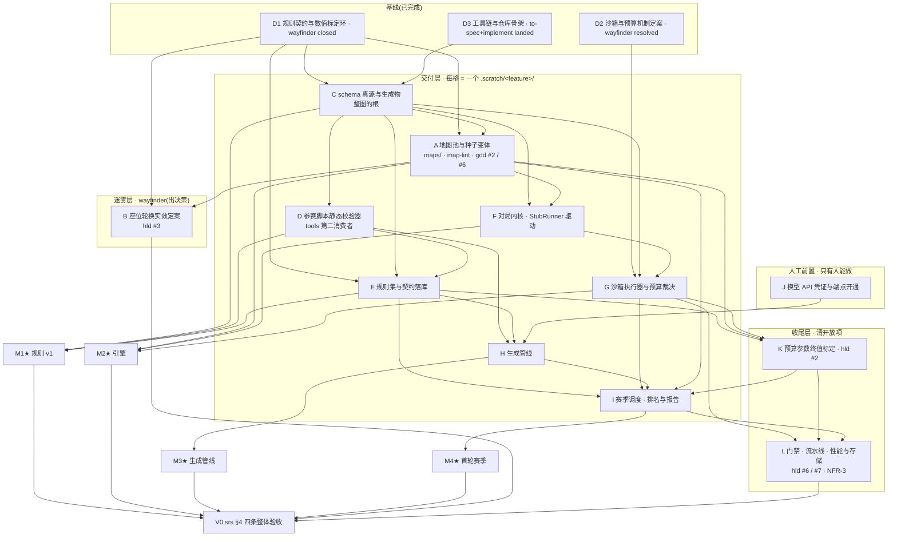

# v0 里程碑目标节点与依赖 DAG

| 项 | 值 |
|---|---|
| 作用 | 把 `fsr.md` §4.2 的四个里程碑(M1–M4)展开成中间目标节点,标出依赖边、关键路径与各节点该走哪条 skill 流程 |
| 本文件拥有 | 从当前基线到 v0 验收的节点划分与依赖拓扑 |
| 本文件不写 | 规则机制与取值(→ gdd / `rulesets/v1.json`)、工程方案(→ hld)、需求定义(→ srs)、里程碑估算(→ fsr) |

## 1. 粒度约定

一个节点 = ask-matt 流程里的**一个工作单元**,不是代码里的一个模块:

- **wayfinder 节点** = 一个 `.scratch/<feature>/map.md` + `issues/`,出**决策**,不出交付物;收口后 `handoff` 交出去,不自己动手实现。
- **交付节点** = 一个 `.scratch/<feature>/` 工作目录,内含 `spec.md` + `issues/`,走主流水线 `grill-with-docs` → `to-spec` → `to-tickets` → `implement`。`implement` 每票内部驱动 `tdd`,收尾跑 `code-review`;**票之间要 `clear`**。
- 人工前置 = `wizard`,只做 agent 做不了的事。

因此**「grill-with-docs」不是独立节点**,它是每个交付节点的入口阶段;把它单列成节点会把粒度切碎。

`/to-tickets` 产出的票已经是 agent-ready,**不要走 `triage`**(ask-matt 明确:triage 只服务外部来的票)。

**归层看的是「这个工作单元出决策还是出交付物」,不看它当前走到哪一步**。一个交付节点在实施中仍然是交付节点,不会因为「决策还没裁完」被挪回迷雾层——挪层等于把它换成一个 wayfinder map,那是换一件工作,不是换一种进度记法。节点 A 由迷雾层改判为交付层(它最终交出 `maps/` 与 `map-lint`,不交决策)时依据的就是这一条;状态列另记进度,两件事分开。

## 2. 基线(已完成,不在图里)

| ID | 状态 | 工作单元 | 流程 | 落到磁盘上的东西 |
|---|---|---|---|---|
| D1 | 已完成 | 规则契约与数值标定环 | `wayfinder`,**closed**(14 票) | 决策在 gdd v2.2;取值与裁决清单在 `handoff.md`;4 份盲写脚本在 `blind/cell-{a,b,c,d}/` |
| D2 | 已完成 | 沙箱与预算机制定案 | `wayfinder`,**resolved**(6 票) | 决策在 hld §5;实测原始输出在 `.scratch/sandbox-budget/spike/` |
| D3 | 已完成 | 工具链与仓库骨架 | `grill-with-docs`→`to-spec`→`to-tickets`→`implement`,已落地 | `apps/cli` + 7 个包 + 三道机器门禁 + `CONTEXT.md` |

**基线的性质**:两张 wayfinder map 都只出决策与 throwaway 证据,没有一份出落库。磁盘现状——

```
rulesets/  maps/  docs/rules-v1/  benchmarks/  prompts/     全是 .gitkeep
```

——是 D1 交接单明说「图外 hand-off」的那部分。**基线那一刻的当前位置是「M1 决策完成、M1 交付物为 0」**;此后节点 A 已落库 `maps/`,其余目录的现状见 §6。

## 3. 主图



## 4. 节点表

**状态列的取值**:`已完成`(工作单元已收口,决策或交付物在磁盘上)/ `实施中`(spec 与票已就绪,正在走主流水线)/ `ready-for-agent`(spec 与票已就绪,可直接开 `/implement`)/ `未开`(尚未开工)/ `未开(人工)`(未开工且只有人能做)。

这一列**不是** issue 的 triage 标签那一套(`docs/agents/triage-labels.md` 管的是票),但 `ready-for-agent` 一词与票文件里的 `Status:` 取值同源——同一状态不两种叫法。

### 迷雾层(`wayfinder`)

| 节点 | 状态 | 目的地 | 硬依赖 | 站位提示 |
|---|---|---|---|---|
| **B 座位轮换实效定案** | 未开 | 量化 `(tick+playerIndex) mod 4` 的头对头偏置,验证赛季尺度被摊平 | D1、**A**(地图决定偏置)、I(首轮赛季是数据来源) | 交接单 §2.3 已给验收命题,但 D1 留下的是「桩在 1168 场上显示座位不等价,量级尚无独立测量」——**这正是 wayfinder 的形状:需要新证据,证据方法本身待定**。前置条件是 I,所以它是全图最后开的一张图。**要不要提前用桩测一轮**是个决策:测了会拿到一个关于已丢弃实现的结论,我倾向不测,直接排到 I 之后 |

### 交付层(每格走 `grill-with-docs` → `to-spec` → `to-tickets` → `implement`)

| 节点 | 状态 | 交付物 | 硬依赖 | 里程碑 | 该走的额外 skill |
|---|---|---|---|---|---|
| **C schema 真源与生成物** | `已完成`([spec](../../.scratch/schema-source/spec.md) · 6 票,**全部 resolved**) | `packages/schema` 的类型 / `JsonValue` / 常量表 / 参数 key 清单(21 键 = 13 定稿 + 8 预算)/ JSON Schema + apps/cli 的 ajv 读入端校验;ruleset 与 map 两类数据的形状;生成器 + 生成物注册表 + 漂移检查 + 声明即依赖门禁 | D1、D3 | — | 已收口。三处当时未决的裁法,落点见 `docs/adr/0003`:①`tools` 走**混合传输**——生成器 import 真源包(低频入口可 afford 构建),规则层读**生成物**(保住快门禁零构建);②`tools` 的依赖门禁缺口**在本节点补掉**了(`check:declared-deps`,不走 depcruise,理由见其规则头注);③键数是 **21 不是 22**:spec 原文把「内存软阈」当预算键数了一遍,而它按 spec 自己的规则**不入键清单**(纯推导展示项)——见 hld §7.1 |
| **A 地图池与种子变体** | `实施中`([spec](../../.scratch/map-pool/spec.md) · 7 票;`variantSlots` 形状定稿、`map-lint` 单图层与池层断言、三张真图已落库,剩 gdd #6 裁决与文档回填两票) | `maps/` 三张四重对称真图(点位布局三图共用,风格 100% 由墙承载)+ `modelwar map-lint` 的两层判据(阈值归校验器常量)+ `variantSlots` 定稿为静态候选轨道清单 + gdd #2/#6 的文档收口 | C(地图形状与读入端校验都出自它)、D1(点位坐标与标定依据) | **M2★**(与 F 合) | 坐标与墙形这类「要看着图判断风格够不够迥异」的票走 `prototype`(原型产物已合进主干,不改写);`codebase-design` 定 map-lint 的「纯规则层 / 目录薄壳 / 退出码」三层;**gdd §8 #8 的两条等效命题(拉满经济 400–600 枯竭 / 典型经济 ≤1/4)在带墙的真地图上跑桩复验**,不许沿用无墙夹具的数字。同一票还把**种子数**定到 K = 4,推导链归 gdd《开放项》#6(本表只带指针)——它让 hld §8.1 的 `M × K ≡ 0 (mod 4)` 均摊条件可解,**I 节点的枚举规模由此定死**。别把它与图上的**节点 K**(预算参数终值标定)混成一件:那条边要的输入是**点位数量**,与种子数无关 |
| **D 参赛脚本静态校验器** | 未开 | `tools` 的第二消费者:tsc 编译、禁 `export`/`import`、全局白名单、`__*` 前缀禁令、`Date`/`Math.random` 禁列、脚本体积上限;`gen:validator` 的调用面 | C | — | **交办出去的三笔**:①**全局白名单反转由 `tsc` 执行**(`oxc-parser` 0.152 实测不暴露作用域信息,自建分析器的失败模式是误伤合规脚本,而不对称地致命)→ 参赛脚本的编译配置归 **E**;②「脚本 API 的 `.d.ts`」**家定在 `schema`、内容由 F 与 G 回填**(C 交出了符号表即名字数组,没交类型面);③参赛脚本写 `Math.sqrt` 无人拦 → **gdd §8 #11**。详见 `.scratch/script-validator/spec.md` | `codebase-design` 定「纯规则(源码→违规) / 目录薄壳 / 退出码」这三层——骨架里已有这个形状,D 是往里加第二组规则,不是新造。**同时补上 tools 的依赖门禁缺口**(C 或 D 决定) |
| **E 规则集与契约落库** | 未开 | `rulesets/v1.json` 21 键(13 定稿 + 8 预算,预算键先取未定值 0)+ `docs/rules-v1/{rules.md,api.md}`(散文按 handoff §4 的 21 条裁决改草案,数值表与 API 表由 C 生成)+ 用**终稿**契约重跑盲写 + `benchmarks/` 落库 | C、D、D1 | **M1★** | 盲写复跑直接复用 `blind/blind-run.sh` 的隔离舱方案(已 smoke test 过),不改。21 条裁决已裁完,**不需要再 grill**——`grill-with-docs` 只确认「终稿 API 面与 D、E6 的实现形状同源」这一条。**并结掉 A 交办的那笔账**:gdd §8 #8 的两条等效命题要在**终稿契约**下再验一次——A 那次验的是标定环留下的草案脚本,与 v0 实际用的脚本不是同一批 |
| **F 对局内核** | 未开 | `world` + `driver`(状态模型、id 升序不变量、整数 LCG + `IdGen`、`apply()` 唯一写入口)、`processor` 七步结算管线 + `intents/*.ts` 的 `check()`/`run()`、`snapshot`(深拷贝 + 只读封存)、`Runner` 缝 + `StubRunner`、`replay` 包全行格式与解析、`replay-writer`;`modelwar replay` 的 ASCII 查看器 | C、E(机制)、A(端到端验收要真地图) | **M2★**(与 G 合) | `codebase-design` 定 `processor` 与 `intents` 的缝、host 侧 `check()` 与 VM 内 dual validation 的共享方式。**用 StubRunner 先打通,让 E9 那条「跑一个完整对局」的闸门提前开**;G 落地后换 QuickJsRunner,结算管线一行不改。**接住 A 交办的首触实测复核**:原型只做到估算口径,真引擎跑出来的值未知,而复核**必须带上 gdd §4 记的那条基线偏差**(与墙无关),否则数字会被误读成墙的功劳 |
| **G 沙箱执行器与预算裁决** | 未开 | `QuickJsRunner` + `engine/sandbox-runtime`(TS→IIFE bundle)+ WASI 三件套常量 + 桥函数删除 + 四类异常轨 + 双计数 + 内存三层 + `exceptionTicks` 续算;`modelwar match` / `verify` 子进程 | D2、C、F | **M2★** | **本节点第一条验收就是 hld #5 五条复验写回文档并关掉 hld #8**(升级条款在 G 落地前是空头承诺)。`prototype` 只用在一处:hld §2.2.2 把 runtime bundle 的**打包方式**留给实现期,选之前先跑一下 |
| **H 生成管线** | 未开 | `prompts/` 模板数据文件、模型 API 客户端 + 厂商适配 + 退避限流、`models.yaml`、≤5 轮只回喂校验错误、tsc 预编译为 script-mode JS、`archive/<model>/<runId>/` 三件套、meta 完整性校验与缺档拒跑 | E(文档即 prompt 输入)、D(校验器)、**J(凭证)** | **M3★** | **与 F/G 零依赖,可完全并行**。凭证由 `wizard` 提前办 |
| **I 赛季调度、排名与报告** | 未开 | 组合×地图×种子枚举 + `(mapIndex+seedIndex) mod 4` 座位轮换 + `M×K ≡ 0 (mod 4)` 均摊断言、对局子进程池 + `engine-crash`/`nondeterministic-timeout` 重跑与剔除、`input.json` 输入物化、`ranker` 名次积分纯函数、`report.md`/`report.json`/叙事战报 + 校验失败名单 + 规则版本隔离、六个子命令接线 | E、G、H、A、K | **M4★** | `research` 用来选 ≥4 个真实模型(可用性 / 端点 / 定价 / 上下文长度是否够读两份契约)——这是 M4 唯一需要外部一手资料的地方。`ranker` 是纯函数无依赖,可以在 H 还在跑的时候顺手做掉 |

### 人工前置

| 节点 | 状态 | 内容 | 阻塞 | skill |
|---|---|---|---|---|
| **J 模型 API 凭证与端点开通** | 未开(人工) | 各厂商 API key 走环境变量、端点与账号开通、模型标识 | H(进而 M4) | **`wizard`**——只有人能做,agent 拿不到凭证。它同时是 `wizard` 的教科书场景:生成一份交互脚本,把值写进 `.env`,不靠 agent 再解释一遍 |

### 收尾层

| 节点 | 状态 | 交付物 | 硬依赖 | 归属 |
|---|---|---|---|---|
| **K 预算参数终值标定** | 未开 | 8 个预算键的终值:事件计数上限、API 调用上限、内存分配上限、`memoryTickCeiling`、墙钟软限、墙钟硬超时、`exceptionTickLimit`、脚本体积上限(**内存软阈不在其中**——它是 `0.8 × memoryTickCeiling` 的推导项,按 spec 不入键清单)墙钟硬超时、`exceptionTickLimit`、脚本体积上限 | E(基准脚本实测峰值)、A(点位数量——全图储量 = 点位里的资源点数 × 单矿储量,预算键的口径靠它)、G(真沙箱实测) | hld #2。验收命题已在 handoff §2.1,**不是迷雾,不需要 wayfinder**。但要**先造两个仓库里不存在的对抗探针**(纯计算死循环 / API 轰炸),否则命题②无从验;命题①明写 1168 场实测异常 0 次、零证据。**必须在 I 之前**——赛季要用定值 |
| **L 门禁、流水线与性能与存储** | 未开 | 集成门禁(端到端 + `verify` + 重跑 10 次 hash)、基准门禁(双脚本对打)、生成物漂移检查接入主流水线、Stryker 变异测试配置、快照拷贝粒度(hld #6)、回放体量与夜间扫描的存储/IO(hld #7)、NFR-3 单场墙钟 X、主/夜间流水线建成 | G、K、I | 入口 `grill-with-docs` 要裁「hld #6 / #7 测什么、优化到什么程度算完」——这两条现在是「先测后优化」,没有停止条件 |

## 5. 关键路径与并行度

**关键路径(7 跳)**:

```
C schema 真源 → D 校验器 → E 规则落库(M1★) → F 对局内核 → G 沙箱(M2★) → K 预算终值 → I 赛季(M4★)
```

四条结论:

1. **C 是整张图的根**。它在关键路径上,同时又是 H 的间接前置——**它不落地,四条链全部起跑不了**。
2. **H 与 F/G 零依赖边**。H 只需 E、D、J。FSR 把「引擎 1~2 周 + 管线 1 周」串行估,实际可以并行跑完,前提是 C 先行。
3. **A 是交付节点,不是迷雾**。它硬依赖 C(schema 的地图形状与读入端校验都出自 C),并落库 `maps/` 与 `map-lint`。它不等引擎:gdd §8 #8 的两条等效命题在三张**带墙真图**上跑桩复验,D1 留下的桩只提供无墙基线。它阻塞 F 的端到端验收与 I,并是节点 K 的点位数量输入的前置;它同时把**种子数**钉到 4(结论归 gdd《开放项》#6,本节只带指针),于是 I 的枚举规模不再悬空。
4. **K 卡在 G 与 I 之间**,是唯一被硬阻塞的收尾项。G 排得越晚,赛季越晚。

**当前 frontier**:**A 实施中**(7 票,硬依赖 C 已解除;三张真图与 `map-lint` 两层断言已落库,剩 gdd #6 裁决与文档回填两票),加上随时可开的 **D**(硬依赖 C,现已解除)与人工前置 **J**。

**可并行批次**:

| 波 | 节点 | 说明 |
|---|---|---|
| 0 | D1 D2 D3 | 已完成 |
| 1 | **C** | **已完成**(6 票全收口)。唯一的根,无前置 |
| 2 | J D A F 的非端到端部分 | A 的硬依赖是 C(已在波 1 落地),故与 D 同期开;J 是人工前置,本就不依赖任何节点 |
| 3 | D E H(等 J) | E 完成后 M1★ 即可关 |
| 4 | F(等 A 的地图) | A 落地后 F 的端到端验收才开 |
| 5 | G → M2★ | |
| 6 | K | |
| 7 | I → M4★ | |
| 8 | B L | 两者都要首轮赛季的数据 |

## 6. 从里程碑视角看到的三个真实缺口

FSR §4.2 的 M1 写的是「最小规则集 + 脚本 API 定稿,模型生成 ≥2 个基准脚本验证规则闭环与区分度」。按此口径:

| 缺口 | 事实 | 落在哪个节点 |
|---|---|---|
| **M1 的验收是用草案做的** | 4 舱盲写跑在 `draft/` 契约上;终稿要按 handoff §4 的 21 条裁决改写,其中 6 条是 P0(`getMyIndex()` 单入口、`isError`/`errCode`、快照字段补 API 面、TS/JS 记法自洽) | **E**。终稿重跑不可省,且终稿 API 面必须与 D 的白名单、G 的 bundle 读同一份符号表 |
| **预算参数零证据** | handoff §2.1 验收命题①:1168 场桩实测异常 **0 次**,`exceptionTickLimit` 下限不能凭直觉取值;命题②要的两个对抗探针(纯计算死循环 / API 轰炸)**仓库里不存在** | **K**。不能只做取值,必须先造探针 |
| **M1 交付物在磁盘上仍近乎 0** | 节点 A 已出 `maps/`(三张真图)与 `map-lint`;`rulesets/`、`docs/rules-v1/`、`benchmarks/`、`prompts/` 仍全是 `.gitkeep` | **E** |

**估算口径**:fsr §4.2 声明「hld 已定稿的工程面(沙箱集成实测、schema 真源与生成物 CI、工具链选型)不计入该估算,可能推翻合计值」。这三项现在全部在图上(C、D、G),所以**剩余 3~6 周是在推翻后的口径上重新计的**。本文件不给估算,那是 fsr 的家。

## 7. 一处不该被 DAG 掩盖的事

D1 的桩模拟器跑过 1336 场,给出 gdd §8 全部四条记录(#7 枯竭定位、#9 终局形态边界、#10 骑兵闲置)。但**桩不是引擎**——真正接住那些结论的是 **F 的结算管线**:每条记录都要在真引擎上以属性测试或基准门禁的形式复验一次,否则它们只是关于一个已丢弃实现的观察。图上这条边是 `F ⇢ L`,不在里程碑的显式依赖里,但它决定 M2 收尾要补多少测试。

同理,A 的两条等效命题验完之后还要在 I 的首轮赛季上复验一次。**A 另有两笔交办出去的账,各有一个明确的落点**:

| 交办项 | 落在哪 | 不做会怎样 |
|---|---|---|
| 终稿契约下复验 gdd #8 的两条命题 | **E 落库之后的一次验收**(E 换了脚本,那两条命题就换了对象) | 那两条结论只对标定环的草案脚本成立,与 v0 实际用的脚本不是同一批 |
| 三张图进**真引擎**后的首触实测复核 | **F**(原型只做到估算口径,真引擎的值未知) | **复核必须带上 gdd §4 记的那条基线偏差**——无墙夹具实测的首触中位已经比 `1/15 = 40` 这个设计锚点早 6 tick、与墙无关。不带它去复核,真引擎跑出来的 34/35/37 会被误读成「墙把首触推了」 |

**这是 throwaway 证据的通用账,一次地图池、一次内核、一次赛季,各结一次。**
